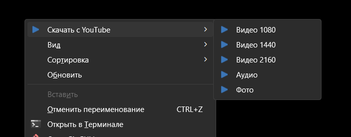
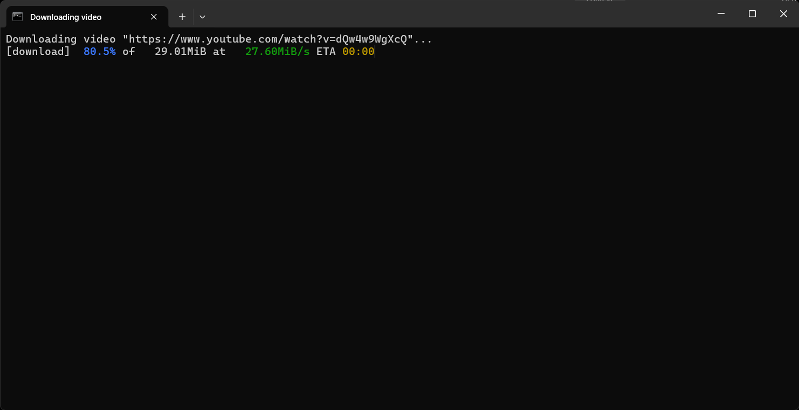

# Скачивайте видео, аудио и фото через контекстное меню Windows 10/11 с многих сайтов

Простой инструмент, который добавляет в контекстное меню Windows 10 и 11 пункт «Скачать видео, аудио и фото» для огромного количества сайтов (YouTube, SoundCloud, TikTok, X/Twitter, Instagram, Pixiv, 4chan и многих других) с помощью **yt-dlp** и **gallery-dl**.

> [!NOTE]
> Протестировано на Windows 11.

---

## Установка

Скачайте архив из [Релизов](https://github.com/a111et/context-yt-dlp/releases), распакуйте в удобное место и запустите один из файлов от имени администратора:

* `_install_.cmd` — добавляет пункты в стандартное контекстное меню.  
* `_install_shift.cmd` — добавляет пункты в контекстное меню, доступные только при зажатой клавише **Shift**.  

> [!TIP]
> Все необходимые компоненты уже встроены в сборку. Дополнительно ничего устанавливать не нужно.

> [!TIP]
> Если видео перестало скачиваться, обновите утилиты до актуальных версий по инструкции в [Wiki](https://github.com/a111et/context-yt-dlp/wiki/%D0%9E%D0%B1%D0%BD%D0%BE%D0%B2%D0%BB%D0%B5%D0%BD%D0%B8%D0%B5-%D0%B8-%D1%83%D0%B4%D0%B0%D0%BB%D0%B5%D0%BD%D0%B8%D0%B5-%D0%BA%D0%BE%D0%BC%D0%BF%D0%BE%D0%BD%D0%B5%D0%BD%D1%82%D0%BE%D0%B2#-%D0%BE%D0%B1%D0%BD%D0%BE%D0%B2%D0%BB%D0%B5%D0%BD%D0%B8%D0%B5-%D0%BA%D0%BE%D0%BC%D0%BF%D0%BE%D0%BD%D0%B5%D0%BD%D1%82%D0%BE%D0%B2).

---

## Удаление

Запустите файл `_uninstall.cmd`. После выполнения скрипта папку с проектом можно удалить.

---

## Как пользоваться

1. **Скопируйте ссылку** на видео, аудио или фото в буфер обмена.  
2. **Откройте папку** в Проводнике Windows, куда хотите сохранить файл.  
3. **Нажмите ПКМ** на пустом месте в папке и выберите пункт `Скачать...`.  
4. **Выберите нужный формат** (видео, аудио или оригинальное качество фото).

---

## Поддерживаемые ресурсы

**yt-dlp** (Аудио и Видео):
* **Видеохостинги:** YouTube, Vimeo, Dailymotion, Twitch, Rutube.
* **Социальные сети:** TikTok, Instagram, Facebook, X (Twitter), Reddit, VK.
* **Музыка:** SoundCloud, Spotify, Bandcamp, Яндекс Музыка.
* И сотни других сервисов.

**gallery-dl** (Изображения и Фото):
* **Соцсети и блоги:** Instagram, X (Twitter), Tumblr, Flickr, Pinterest.
* **Арт-платформы:** Pixiv, Seiga.nicovideo, Nijie.
* **Форумы и боору:** 4chan, 8ku, Danbooru, Gelbooru, e621, yande.re.
* **Манга и комиксы:** Nhentai, ExHentai и различные ридеры.
* И многие другие сайты.

---

## В проекте используются

* [yt-dlp](https://github.com/yt-dlp/yt-dlp) — загрузка видео и аудио.
* [gallery-dl](https://github.com/mikf/gallery-dl) — загрузка изображений.
* [aria2](https://github.com/aria2/aria2) — многопоточная ускоренная загрузка.
* [FFmpeg](https://github.com/BtbN/FFmpeg-Builds) — обработка и конвертация медиафайлов.