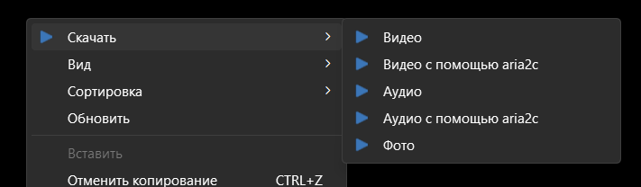

# Скачивайте видео, аудио и фото через контекстное меню Windows 10/11 с многих сайтов

Простой проект, который добавляет в контекстное меню Windows 10 и 11 пункт «Скачать видео, аудио и фото» для большого пула сайтов - таких как YouTube, SoundCloud, TikTok, Twitter/X, Instagram, Pixiv, 4chan и многих других - с помощью yt-dlp и gallery-dl

>[!NOTE]
> Протестировано на Windows 11 (версия 26H1).

---      

## Установка скрипта
Достаточно скачать архив из релизов, распаковать в удобное место и запустить один из установочных файлов от админа:                                                       
* `_install.cmd` — добавляет пункты в стандартное контекстное меню.  
* `_install_shift.cmd` — добавляет пункты в контекстное меню, но они будут видны только при зажатой клавише **Shift**.  

> [!TIP]
> Все необходимые компоненты (yt-dlp, FFmpeg и др.) уже встроены в сборку. Дополнительно ничего устанавливать не нужно.

> [!TIP]
> Если видео перестало скачиваться или возникают ошибки, возможно, стоит просто обновить встроенные утилиты (`yt-dlp`, `aria2`, `FFmpeg` и `gallery-dl`) до актуальных версий.

---

## Удаление скрипта 
Удаление происходит так же просто. Достаточно запустить файл:
* `_uninstall.cmd` (после этого папку с проектом можно удалять).

---

## Как пользоваться скриптом?
1. **Скопируйте ссылку** на нужное вам видео, адуио или фото в буфер обмена.  
2. **Перейдите в папку**, куда хотите сохранить файл, через проводник Windows.  
3. **Нажмите правую кнопку мыши** на пустом месте в папке и выберите `Скачать`.  
4. **Выберите один из вариантов скачивания:**
   * **Видео** — скачивает полное видео в максимальном качестве.  
   * **Видео с aria2c** — то же самое, но загрузка идет быстрее за счет разделения файла на части.  
   * **Аудио** — скачивает только звуковую дорожку в максимальном качестве.  
   * **Аудио с aria2c** — скачивает аудио в многопоточном режиме для максимальной скорости.
   * **Фото** — скачивает фото.

## **Приятного скачивания!**

---

## **Откуда может скачивать?**
 * yt-dlp (аудио & видео): 
 >* Видеохостинги: YouTube, Vimeo, Dailymotion, Twitch, RuTube.
 > *  Социальные сети: TikTok, Instagram, Facebook, X (Twitter), Reddit, VK (ВКонтакте).
 > * Музыкальные платформы: SoundCloud, Spotify, Bandcamp, Яндекс.Музыка.
 > * И другие сервесы

 * gallery-dl (Фото): 
 >* Популярные социальные сети и блоги: Instagram, Twitter, Tumblr, Flickr, Pinterest.
 > *  Иллюстрации: Pixiv, Seiga.nicovideo, Nijie PyPI.
 > * Форумы: 4chan, 8ch, а также сайты типа Booru (Danbooru, Gelbooru, e621, yande.re) PyPI.
 > * Манга и комиксы: Различные сайты для чтения манги, ExHentai, nhentai и другие PyPI.
 > * И другие сервесы

---
## В проекте используются
* [yt-dlp](https://github.com/yt-dlp/yt-dlp) - для загрузки видео и аудио.
* [gallery-dl](https://github.com/mikf/gallery-dl) - для загрузки фото.
* [aria2](https://github.com/aria2/aria2) - для многопоточной загрузки.
* [FFmpeg (gpl)](https://github.com/BtbN/FFmpeg-Builds) - для склейки видео и аудио дорожек.
## Ссылки            
 * [Мой проект на GitHub](https://github.com/a111et/Downloader/releases)
